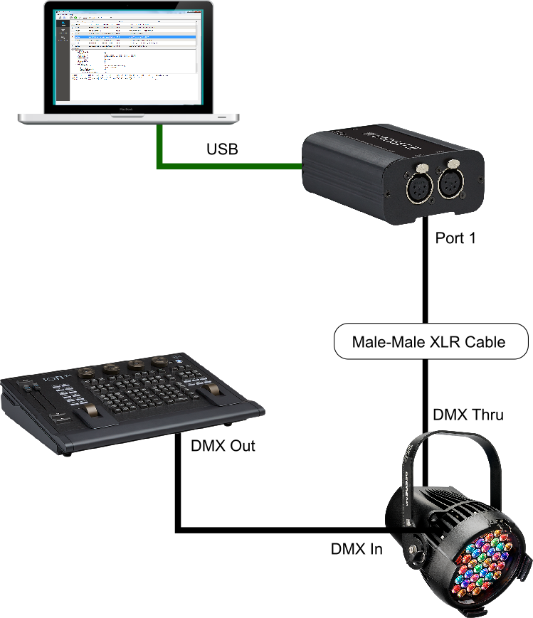

# ETCDmxTool

ETCDmxTool is a free, open-source tool with the ability to capture DMX/RDM data; to control DMX levels; and to act as an RDM controller. It is provided by ETC Inc without any warranty, in the hope that it is a useful tool.

# Supported Platforms and DMX Devices
ETCDmxTool supports Windows (Win 7/Win 10) only.

To interface to a DMX/RDM system, it supports two USB devices - the ETC Gadget2 and the ETC-USB whip. The features available differ slightly depending on the selected device:

| Feature              | USB Whip | Gadget2                             |
|----------------------|----------|-------------------------------------|
| DMX/RDM Data Capture | Yes      | Yes (Needs Firmware 1.2.0 or above) |
| DMX Output           | Yes      | Yes                                 |
| RDM Controller       | No       | Yes                                 |

# Connecting to a system
In order to sniff DMX/RDM, you will need to wire your Gadget2 in to your system in a slighly unusual way using male-male XLR connectors or similar. Below is an example of how this might be set up.

# Installation
An installer for the application is coming soon!

# Building
If you are interested in building the application you will need the following:

* Qt Library and Creator - https://www.qt.io/ide/
* To build the windows installer - NSIS - http://nsis.sourceforge.net/
	* If NSIS is included in your $PATH the installer will be built automatically

The dissectors are arranged as plugins; additional dissectors can simply be added to the src/dissectors directory
