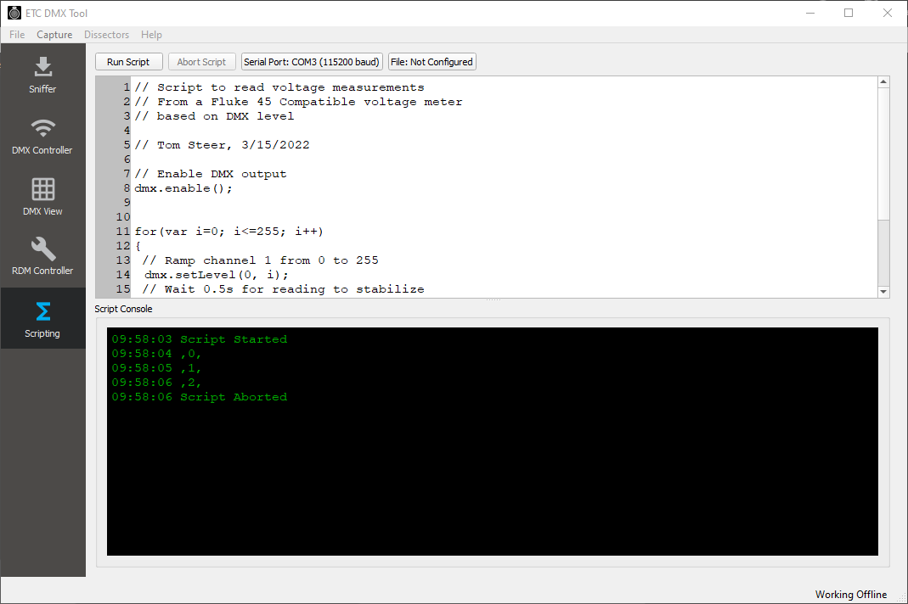

# Scripting

The application features the ability to run scripts controlling DMX outputs and interacting with other features such as a file or a serial port on the computer. This can be useful for creating automated tests, for example ramping a DMX level while measuring the output of a dimmer, or cycling a relay while looking for a particular serial string.

## Scripting Examples

Scripting examples are stored in the scripts folder, which is installed in the program installation directory, or the root of this repository.

- fluke45.js : provides an example that ramps a DMX address from 0 to 255 and reads the voltage from a Fluke 45 compatible serially-connected voltage meter, and logs it to the 

- catchError.js : provides an example that turns a DMX address on and off every 5 seconds but stops once it sees the text "ERROR" recieved over the serial port

## Scripting introudction

The application uses Qt's QJSEngine, which provides an ECMAScript/Javascript compatible engine. See [here](https://developer.mozilla.org/en-US/docs/Web/JavaScript/Guide/Introduction) for a general introduction to Javascript/ECMAScript.

To start work with scripting, click on the scripting icon on the left hand mode selection bar.

The window is divided into two sections - the upper section provides a simple editor to allow editing a script; the lower section provides a "console" which shows output and status as the script runs.

The upper buttons provide the following functions:
- Run Script - runs the script (if it is not already running)
- Abort Script - aborts the script (if it is already running)
- Serial Port - configures the serial port, if required by the script
- File - configures the file, if required by the script

# Errors
If their are syntax errors in the script when you attempt to run it, the line with the errors will be highlighted in red and the script will not run.

# Scripting Language and Objects

## DMX Object
The DMX object allows you to transmit DMX. It provides the following functions

`dmx.enable()` - enables the DMX output

`dmx.disable()` - disables the DMX output

`dmx.setLevel(address, level)` - Sets the DMX output `address` (0-511) to level value `level`. Note that address is zero-based, i.e. an address value of zero corresponds to DMX address 1.

## Serial Object
The serial object provides access to a serial port on the PC. It is only available once you have set the port up (using the Serial Port button).

`serial.writeText(text)` - Writes the specified text to the serial port

`serial.readText()` - Reads the serial port buffer and returns the content as text

## File Object
The file object provides access to a file on the PC. It is only available once you have set the file up (using the File button)

`file.open()` - Opens the specified file

`file.write(text)` - Writes the specified text to the file

## Utilities
Some additional non-ECMAScript standard utilities are provided:

`timestamp()` - Returns the current date and time as a string

`sleep(milliseconds)` - Pauses the execution of the script for the specified number of milliseconds

`console.log(string)` - Writes the string to the console shown on the bottom part of the screen